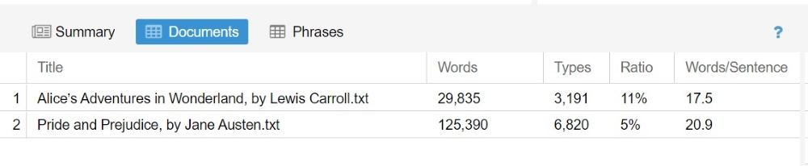

# Introduction to Voyant

Voyant Tools is an open-source text analysis tool available online. It was designed with the digital humanities in mind, with the goal of making reading and interpretation easier for its users. With plain text, HTML, XML, PDF, RTF, and MS Word files, Voyant can generate word clouds, display word frequency or collocation, and perform other text mining functions. Voyant Tools have been used by researchers to analyze texts in a variety of contexts, including literature, language teaching, healthcare, and system architecture.

----

## Single Text Analysis 

I am currently looking for a job and would like to create a resume and cover letter in such a way that it get shortlisted for the further interview process. Outstanding cover letters and resumes can turn a middle-of-the-road candidate into a top contender. It is vital to create a resume and cover letter in a manner that it is selected by recruiters. Recruiter uses sourcing tools to shortlist resumes and cover letters for the interview process. Sourcing tools aim to shortlist candidates through smarter job matching. The goal is to create a pool of quality candidates who have skill sets that are as close as possible to the job description criteria.

I will use Voyant to analyze job posting text to draw upon the important words/text and utilize those to craft my resume and cover letter. Please download the job posting description for this module by clicking [HERE](https://github.com/DagaGargi/Step-by-Step-guide-to-Voyant/raw/master/Job%20Posting.docx)

----

## Getting Started

* Start by opening [Voyant](https://voyant-tools.org/) in your web browser. There are three ways to open a corpus or text for analysis. The first option is to choose open. This will give you the option to work with one of the pre-loaded corpuses in Voyant - the complete works of William Shakespeare, and the complete works of Jane Austen. These are good resources if you’re curious to see what you can do in Voyant, or if you happen to be working on research about either of these corpuses.

* Second option is where users can paste in the text to be analyzed directly into the text area, or paste the URL of the website to be analyzed.

* Third option is to select upload to upload your own text or corpus. Choose the job posting description file from your computer that we downloaded in the previous section to analyze from this point. Voyant understands plain text, HTML, XML, PDF, RTF, and MS Word.

* Once you’ve uploaded the file, you’ll see your Voyant “dashboard”. 

**Please watch the video below for quick review on getting started with Voyant Tool**

<iframe src="https://h5pstudio.ecampusontario.ca/h5p/44040/embed" width="993" height="584" frameborder="0" allowfullscreen="allowfullscreen"></iframe>

----

## Understanding Voyant Dashboard

Please click on the pink info icons on the image below to learn more about the different tools on Voyant Dashboard.

<iframe src="https://h5pstudio.ecampusontario.ca/h5p/43970/embed" width="993" height="590" frameborder="0" allowfullscreen="allowfullscreen"></iframe>

----

## Learning Different Tools 

There are various other tools offered by Voyant: corpus tools, document tools, visualization tool, grid tools and other tools. To choose another tools, you will have to hover the cursor on the left hand side of the question mark, just besdies other tool. As soon as you will hover the cursor, you will see three different icons. Click on the middle icon( windows symbol) to view  different tools. 

There are certain tools which are repetitive, for the purpose of this module, we have excluded the repetitive tools. In order to learn more about various tools, please refer below:- 

<ins>**Corpus Tools**</ins>

*	Terms: A table view of term frequencies in the entire corpus.
*	Collocates: Represents terms that occur in close proximity.
*	DreamScape: A preliminary attempt to explore how texts might be represented geo-spatially. The tool tries to identify locations (especially city names) mentioned in texts and suggests patterns of recurring connections between locations, patterns that might help identify travel of people, ideas, goods, or anything else.
*	Veliza: An experimental tool for having a (limited) natural language exchange (in English) based on your corpus.
*	WordTree: A tool that allows you to explore how words are used in phrases.
*	Documents: The assembled documents in the Voyant session, if you are analyzing more than one document.

<ins>**Document Tools**</ins>

*	Reader: Reader allows you read the document being analyzed.
*	Topics: Generates term clusters from the document.
*	Contexts: Shows each occurence of a keyword with their context.
*	Document Terms: A table view of term frequencies for each document.

<ins>**Visualization Tools**</ins>

*	Knots: Visualization that represents terms as a series of twisted lines.
*	Bubbles: Visualization of term frequencies by the document. Looks like a bunch of bubbles on a screen, with a word in each bubble.
*	Mandala: Visualization that shows the relationships between terms and documents. Each search term (or magnet) pulls documents toward it based on the term's relative frequency in the corpus.
*	MicroSearch: Visualizes the frequency and distribution of terms across the document or documents.
*	StreamGraph: Visualization that depicts the change of frequency of words in a corpus.
*	ScatterPlot: Visualization of how words cluster in a document.
*	TermsRadio: Visualization that depicts the changes in the frequency of words in a document(s).
*	TextualArc: Visualization of terms that include a weighted centroid of terms and an arc that follows terms in document order.
*	Links: The collocation of terms in a corpus displayed in a network.

----
## Multiple Text Analysis

When you read many novels or poems, how do you analyze them? What kind of information do you look for, and how do you decide what it means? Voyant can be also utilized to perform multiple text analyses. Multiple text analysis generally involves detecting patterns, such as identifying word frequency or associative links between words and comparing two or more texts. The most frequent usage of multiple text analysis is for distant reading. Distant reading refers to the use of computational methods to analyze literary texts without actually reading the whole document. 
We will perform the multiple text analysis on two books that are taken from [Project Gutenberg]( https://www.gutenberg.org/). Project Gutenberg is a library of over 60,000 free eBooks. 

***Part One:***

Please open your [Voyant Tool](https://voyant-tools.org/). Once it is opened, please copy, and paste the below-mentioned links for the books- Alice Adventures in Wonderland and Pride and Prejudice under the **ADD TEXT** section. 

<mark>https://raw.githubusercontent.com/DagaGargi/Introduction-to-Text-Analysis-with-Voyant-Tools/master/Alice%E2%80%99s%20Adventures%20in%20Wonderland%2C%20by%20Lewis%20Carroll.txt</mark>

<mark>https://raw.githubusercontent.com/DagaGargi/Introduction-to-Text-Analysis-with-Voyant-Tools/master/Pride%20and%20Prejudice%2C%20by%20Jane%20Austen.txt</mark>

*Please make sure to put both the links under separate lines*

***Part Two:***

You will see a Voyant dashboard that gives the analysis for both texts.

The summary tab will you provide a comparative analysis of the novels on the basis of document length, vocabulary density, average words per sentence, readability index, most frequent words in the corpus, and distinctive words. 

When you will click on the document tab, it will reveal the words, types, ratios, and words/sentences for both novels. 

----

**This workshop is brought to you by the Brock University Digital Scholarship Lab.  For a listing of our upcoming workshops go to [Experience BU](https://experiencebu.brocku.ca/organization/dsl) if you are a Brock affiliate or [Eventbrite page](https://www.eventbrite.ca/o/brock-university-digital-scholarship-lab-21661627350) for external attendees.  For additional inquiries, contact [DSL@Brocku.ca](mailto:DSL@Brocku.ca)**

